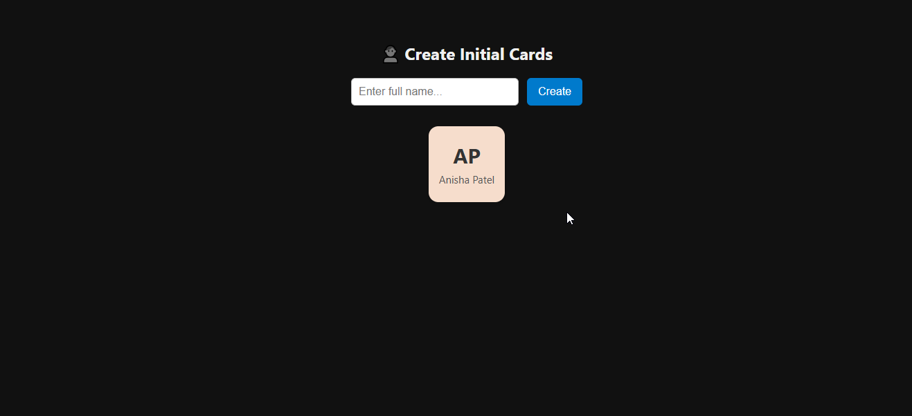

## 📌 Note

## 🧊 3. **Avatar Initial Card Generator** — `README.md`

```markdown
# 🧑‍🎨 Avatar Initial Card Generator

Generate beautiful pastel-colored cards using the **first letters** of a name. Lightweight and interactive UI.

## 🛠 Features
- Input any name and generate initials
- Each card is colorized randomly using pastel tones
- Remove cards with ❌ button
- Responsive and modern UI
- Clean structure with easy-to-read code

## 💡 Example
Name: `Anisha Patel` → Card: `AP`

## 💻 Tech Used
- HTML
- CSS (variables + flexbox)
- JavaScript (DOM manipulation)

## 🧾 How It Works
1. Type a full name
2. Click “Create”
3. Card is added with initials (first + last name's first letter)
4. Click ❌ to delete a card

## 📁 Project Files

